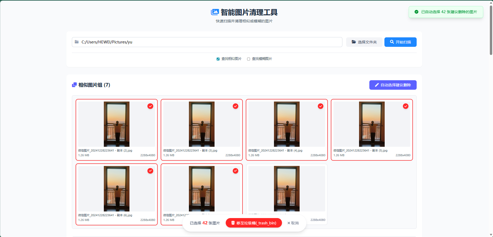

# PhotoClean

智能图片清理工具 - 快速扫描并清理相似或模糊的图片。

## 功能特点

- **Web 界面**: 简单易用的浏览器界面
- **相似图片查找**: 使用感知哈希算法 (pHash) 查找相似图片
- **模糊图片检测**: 基于拉普拉斯方差检测模糊图片
- **安全删除**: 文件被移动到垃圾桶文件夹 (`_trash_bin`)，由用户决定去留

## 安装

```bash
pip install photoclean
```

## 使用方法

安装完成后，在终端运行：

```bash
photoclean
```

浏览器将自动打开 `http://127.0.0.1:5000`。

## 开发

1. 克隆仓库
2. 安装依赖: `pip install -r requirements.txt`
3. 运行: `python -m photoclean.main`

## License

MIT
